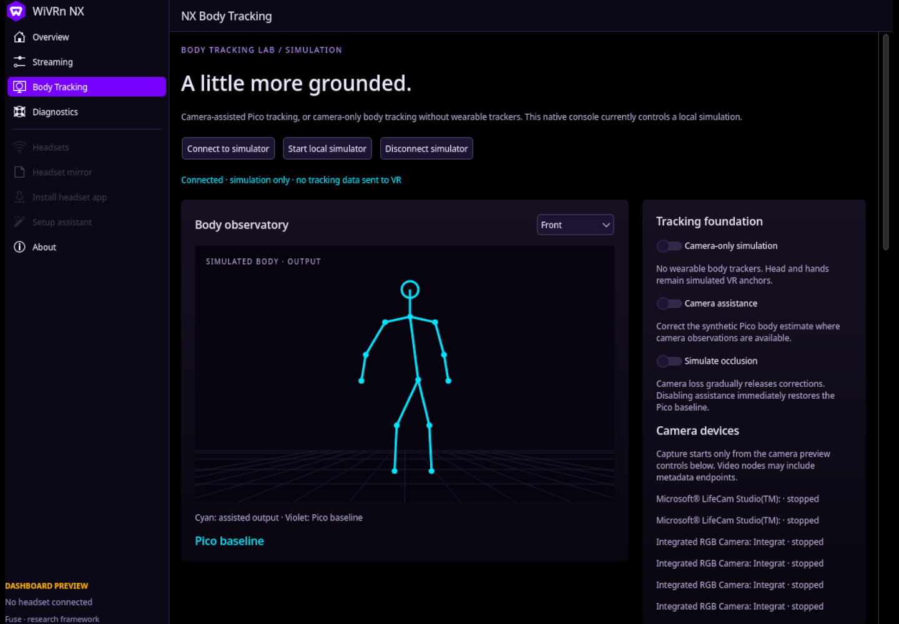

<div align="center">

# NX Fuse

**A little more grounded.**

Camera-assisted Pico full-body tracking research for WiVRn NX.

[Project website](https://nerdrx.github.io/nx-fuse/) · [Native WiVRn NX dashboard](https://github.com/nerdrx/wivrn-nx/tree/nx-patches) · [Dashboard guide](https://github.com/nerdrx/wivrn-nx/blob/nx-patches/docs/NX-DASHBOARD.md) · [Build plan](docs/PLAN.md)

**Research framework · native dashboard · opt-in camera capture and estimation**

</div>



*Native Qt/Kirigami Body Tracking preview. The VR comparison shows synthetic
poses; cameras are stopped. This is not a tracking-quality measurement.*

## The idea

Keep Pico's continuous motion and use cameras to correct visible body joints.
A room camera watches standing movement; an overhead camera could cover the
bed. Each calibrated view contributes only when timing, visibility and geometry
are trustworthy. Hidden joints return to Pico. Headset and controllers stay
authoritative.

## Run the framework

Python 3.10+; simulation has no third-party runtime packages. Linux enables
camera-device discovery. Optional live capture and MediaPipe estimation use the
isolated setup in [CAMERA-SETUP.md](docs/CAMERA-SETUP.md).

```sh
git clone https://github.com/nerdrx/nx-fuse.git
cd nx-fuse
python3 app.py
```

Open **http://127.0.0.1:8787**. Alternatively run `./Launch\ NX\ Fuse.sh`.
Use `--port 8789` if the default port is occupied. Stop with Ctrl+C.

Enable **Camera assistance**, then **Simulate occlusion** to watch corrections
fade. Assistance starts off. Switching assistance off is an immediate baseline
bypass; ordinary observation loss fades, with a hard 0.5-second expiry from
the last accepted capture. These are provisional simulation policies.

The application binds only to loopback. Discovery does not open cameras. The
native WiVRn NX dashboard is built separately in the linked dashboard project;
it provides the local Body Tracking page and keeps VR output outside this
simulation service.

The debug capture API opens a selected device only after explicit
`POST /api/camera/control` with `{"id":"/dev/video0","enabled":true}`;
`false` stops it. `GET /api/camera/frame?id=...` returns only the bounded latest
JPEG. Optional MediaPipe estimation adds a 2D landmark overlay and hip-relative
model-inferred 3D coordinates. Those coordinates are uncalibrated and are not
VR-space depth. It does not record images, inject poses into WiVRn, or modify
headset software.
Video-device entries may include multiple endpoints from the same camera;
discovery does not establish how many simultaneous usable feeds exist.

## Continue in the native tracking lab

The [tracking lab guide](docs/TRACKING-TAP.md) launches the worker before
WiVRn so the optional raw-pose feed is ready. The native camera panel now has
[lens setup](docs/LENS-CALIBRATION.md): collect varied chessboard views, solve
intrinsics/distortion, inspect held-out error and export the profile. These
steps do not yet align the camera to VR or apply live corrections.

## What works now

- Responsive violet/cyan console with front/side skeleton comparison,
  assistance and occlusion controls, Linux video-device discovery, and an
  explicit camera capture path.
- Native WiVRn NX dashboard available in the linked project, with a Body
  Tracking page for local camera discovery and opt-in capture.
- Camera frames can show a MediaPipe 2D landmark overlay plus hip-relative
  inferred 3D landmarks; this is a camera observation tool, not calibrated VR tracking.
- Debug panels show the synthetic camera projection and an observation inspector
  with joint Z, confidence, age and input availability, separate from final poses.
- Position-only fusion with per-joint confidence, freshness checks, bounded
  camera influence, disagreement rejection, duplicate-source suppression,
  protected head/hands, and fallback after observation loss or process gaps.
- Camera-only simulation with no body-tracker baseline: missing body observations
  become unavailable while simulated headset/controller anchors remain.
- Deterministic JSONL replay and automated tests covering fusion and local API behavior.
- Read-only WiVRn packet tap and native raw-pose inspector for anchors, BD
  joints and generic HTC trackers; hardware validation is still pending.
- Native chessboard lens setup with held-out reprojection checks and profile export.

## What remains

### Other trackers and no body trackers

The fusion core accepts named baseline joint positions without depending on a
tracker SDK. Pico through WiVRn NX is the first planned hardware adapter and
the only hardware currently available for evaluation. Other IMU or optical
tracker systems are future adapter candidates, not supported integrations.
See [tracker compatibility](docs/TRACKERS.md) for the contract and test gates.
The **Camera-only simulation** switch demonstrates the no-body-tracker path.
The current one-camera path provides MediaPipe 2D landmarks and hip-relative
inferred 3D coordinates. Read the sourced [monocular research plan](docs/MONOCULAR.md).
The estimate is uncalibrated to VR and is not measured camera depth.

Real tracker injection, camera-to-VR calibration, historical time alignment,
person association for live correction, and hardware evaluation remain future
work. The simulation averages already-calibrated positions; it does **not**
implement the planned latency-aligned residual pipeline. There is no measured
tracking improvement yet.

Read the [milestones and acceptance gates](docs/PLAN.md) before enabling live
output. The next hardware milestone is validating the read-only tap in the
linked WiVRn NX build before camera-to-VR alignment and shadow correction.

## Develop and replay

```sh
python3 -m unittest -v
python3 replay.py poses.jsonl > fused.jsonl
```

Each input line is one frame. All positions must already be metres in the
same calibrated tracking space; all times must share one monotonic clock:

```json
{"time":1.0,"enabled":true,"baseline":{"hip":[0,1,0]},"observations":[{"camera":"room","joint":"hip","position":[0.1,1,0],"confidence":0.9,"timestamp":0.98}]}
```

Submit successive frames to see blending; the first frame initializes time
and preserves the baseline. Replay emits one result per line. Invalid frames
report their line number. This format is an offline research input, not the
planned real-time WiVRn wire protocol. Use `Fusion.reset()` after calibration,
recenter or session changes; the current module cannot detect those itself.

## Validation

See [VALIDATION.md](docs/VALIDATION.md) for the checks actually performed.
The model thresholds are engineering defaults, not confidence calibration or
latency guarantees. No camera footage or personal pose recordings are included.

## Website

`site/index.html` is a standalone page with no build step or external assets.
GitHub Pages serves the `gh-pages` branch. After editing the website:

```sh
git subtree push --prefix site origin gh-pages
```

## License

MIT for this original framework. Any future WiVRn patch must respect WiVRn's
license; this repository does not copy WiVRn implementation code.
