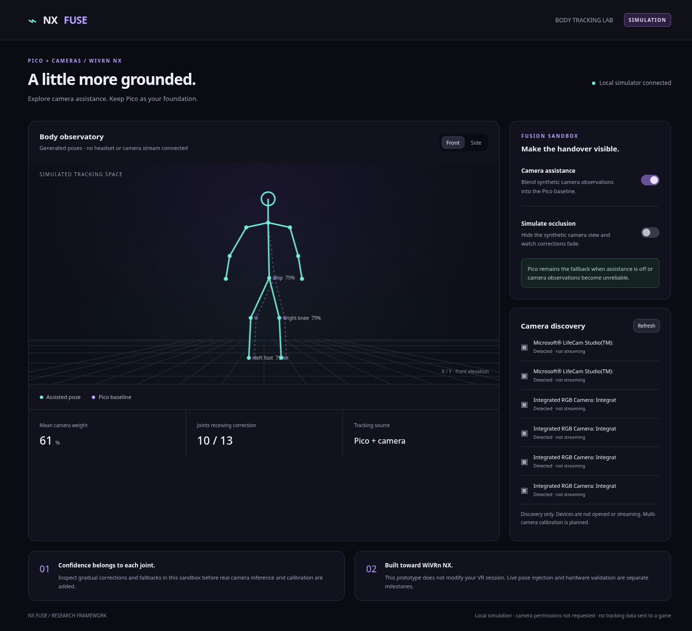

<div align="center">

# NX Fuse

**A little more grounded.**

Camera-assisted Pico full-body tracking research for WiVRn NX.

[Project website](https://nerdrx.github.io/nx-fuse/) · [Build plan](docs/PLAN.md) · [WiVRn integration map](docs/WIVRN-INTEGRATION.md)

**Research framework · working simulation · no live tracking adapter yet**

</div>



*Synthetic Pico and camera observations, shown in the local console. This is
a simulation screenshot, not evidence of camera or headset tracking quality.*

## The idea

Keep Pico's continuous motion and use cameras to correct visible body joints.
A room camera watches standing movement; an overhead camera could cover the
bed. Each calibrated view contributes only when timing, visibility and geometry
are trustworthy. Hidden joints return to Pico. Headset and controllers stay
authoritative.

## Run the framework

Python 3.10+; no third-party runtime packages. Linux enables camera-device
discovery. Other platforms can run the simulation without discovery.

```sh
git clone https://github.com/nerdrx/nx-fuse.git
cd nx-fuse
python3 app.py
```

Open **http://127.0.0.1:8787**. Alternatively run `./Launch\ NX\ Fuse.sh`.
Use `--port 8789` if the default port is occupied. Stop with Ctrl+C.

Enable **Camera assistance**, then **Simulate occlusion** to watch corrections
fade. Assistance starts off. Switching assistance off is an immediate baseline
bypass; ordinary observation loss fades, with a hard 0.5-second expiry from
the last accepted capture. These are provisional simulation policies.

The application binds only to loopback. It does not open cameras, record
images, connect to WiVRn, or modify your installed headset software.
Video-device entries may include multiple endpoints from the same camera;
discovery does not establish how many simultaneous usable feeds exist.

## What works now

- Responsive violet/cyan console with front/side skeleton comparison,
  assistance and occlusion controls, and Linux video-device discovery.
- Position-only fusion with per-joint confidence, freshness checks, bounded
  camera influence, disagreement rejection, duplicate-source suppression,
  protected head/hands, and fallback after observation loss or process gaps.
- Deterministic JSONL replay and eight tests covering fusion and local API behavior.
- Source-inspected WiVRn integration plan covering both BD skeleton/virtual
  trackers and HTC generic trackers.

## What remains

Real camera capture and pose estimation, person association, camera-to-VR
calibration, historical time alignment, a WiVRn pose tap and correction
adapter, and hardware evaluation. The simulation averages already-calibrated
positions; it does **not** implement the planned latency-aligned residual
pipeline. There is no measured tracking improvement yet.

Read the [milestones and acceptance gates](docs/PLAN.md) before enabling live
output. The first live milestone is a read-only baseline tap in an isolated
WiVRn worktree. No changes have been made to WiVRn by this framework.

## Develop and replay

```sh
python3 -m unittest -v
python3 replay.py poses.jsonl > fused.jsonl
```

Each input line is one frame. All positions must already be metres in the
same calibrated tracking space; all times must share one monotonic clock:

```json
{"time":1.0,"enabled":true,"pico":{"hip":[0,1,0]},"observations":[{"camera":"room","joint":"hip","position":[0.1,1,0],"confidence":0.9,"timestamp":0.98}]}
```

Submit successive frames to see blending; the first frame initializes time
and preserves the baseline. Replay emits one result per line. Invalid frames
report their line number. This format is an offline research input, not the
planned real-time WiVRn wire protocol. Use `Fusion.reset()` after calibration,
recenter or session changes; the current module cannot detect those itself.

## Validation

See [VALIDATION.md](docs/VALIDATION.md) for the checks actually performed.
The model thresholds are engineering defaults, not confidence calibration or
latency guarantees. No camera footage or personal pose recordings are included.

## Website

`site/index.html` is a standalone page with no build step or external assets.
GitHub Pages serves the `gh-pages` branch. After editing the website:

```sh
git subtree push --prefix site origin gh-pages
```

## License

MIT for this original framework. Any future WiVRn patch must respect WiVRn's
license; this repository does not copy WiVRn implementation code.
